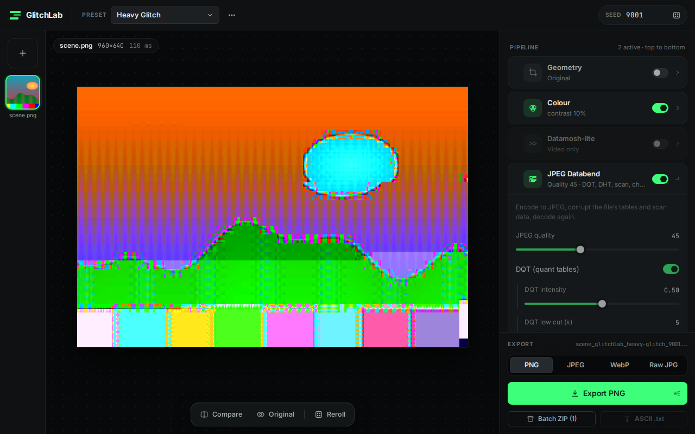
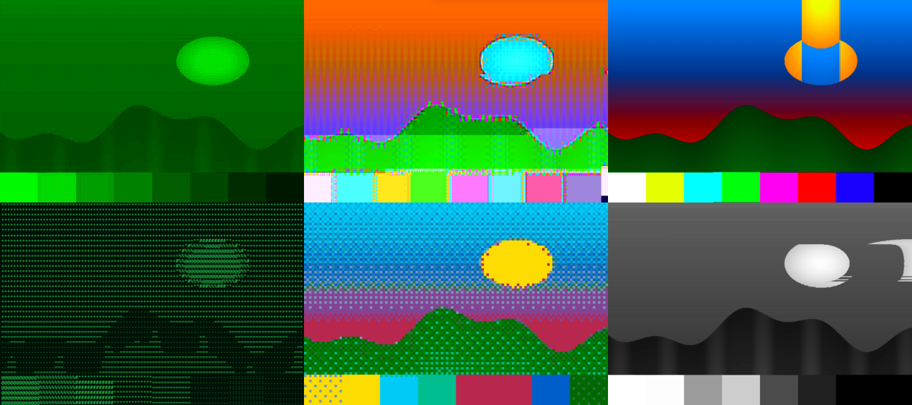
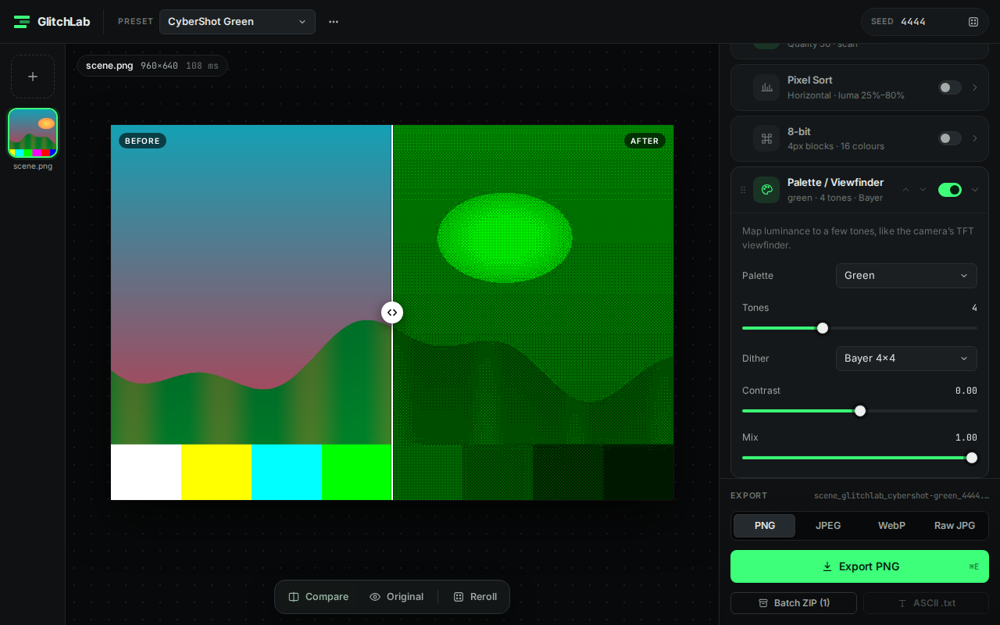
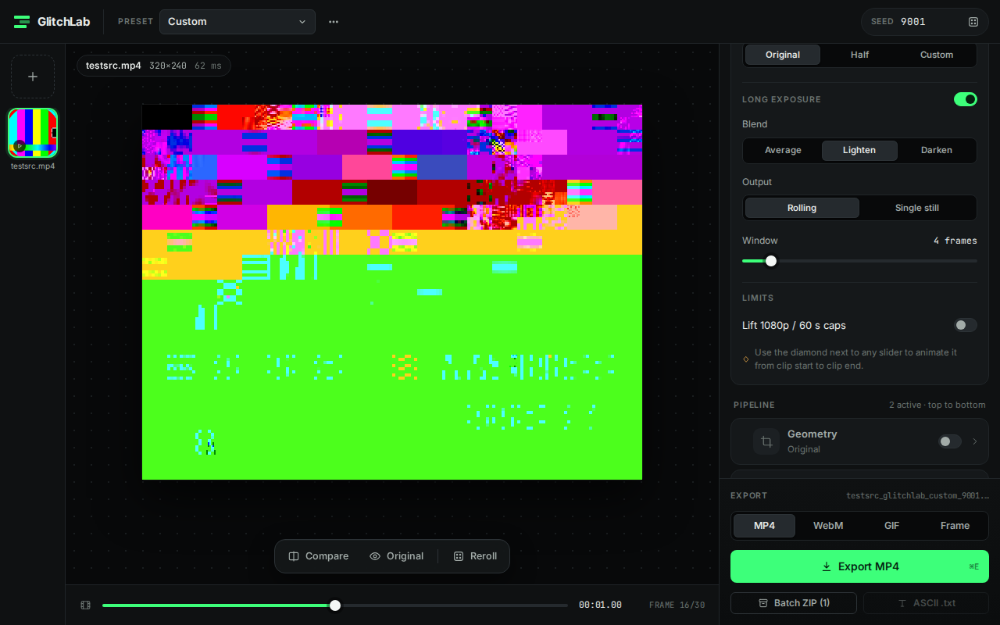
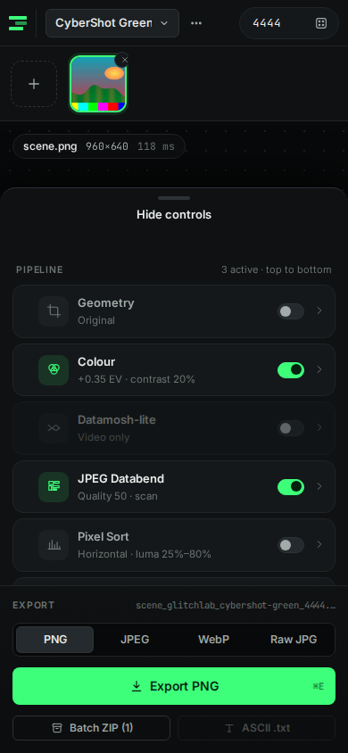
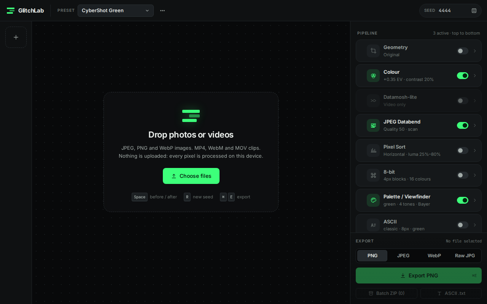

# ▚ GlitchLab

**A browser-based photo & video glitch-effects tool.** Drop in images or
videos, stack effects (JPEG databending, viewfinder palettes, pixel sorting,
8-bit, ASCII, long exposure, datamosh…), tweak parameters with a live preview,
and export stills, videos, GIFs or a whole batch as a ZIP.

Everything runs **locally in your browser**: no backend, no uploads. It builds
to a static site you can host anywhere.

GlitchLab is inspired by the **[CyberShot Cam](https://github.com/cebola4444/cybershot-cam)**
project by cebola4444, an ESP32-S3 DIY camera with JPEG databending, 4-tone
viewfinder palettes, long-exposure stacking and a web editor built into its
firmware. GlitchLab reimplements those *ideas* from scratch in TypeScript for
the browser. No code from that project is used (it has no licence).



| Built-in presets (CyberShot Green · Heavy Glitch · Light Trails / Terminal ASCII · 8-bit Arcade · Noir Sort) |
|---|
|  |

| Before/after compare | Video: glitch + light-trail stacking | Mobile (bottom sheet) |
|---|---|---|
|  |  |  |



---

## Running it

Requires Node 20+ (tested with Node 22).

```bash
npm install        # from the repository root (npm workspace → glitchlab/)
npm run dev        # http://localhost:5173
npm run build      # static site in glitchlab/dist/
npm run preview    # serve the production build
```

Everything is also available inside `glitchlab/` directly (`cd glitchlab && npm run dev`).

| Script | What it does |
|---|---|
| `npm run typecheck` | `tsc -b` across app, tests and config (strict) |
| `npm run lint` | ESLint (typescript-eslint + react-hooks) |
| `npm test` | Vitest unit tests (effects, codec, pipeline, presets, stacking) |
| `npm run test:e2e` | Generates fixtures, builds, and runs Playwright end-to-end tests in Chromium. Set `E2E_DEV=1` to run against the dev server instead. |
| `npm run fixtures` | Generates synthetic test media into `glitchlab/fixtures/` (nothing is downloaded; videos come from ffmpeg's `testsrc`) |
| `npm run preset-sheet -w glitchlab` | Dev tool: renders every built-in preset to `glitchlab/test-results/sheet/` |

**Deploying:** copy `glitchlab/dist/` to any static host. It uses relative
paths, so it works from a sub-folder. It needs no special headers (no
COOP/COEP): the single-threaded ffmpeg.wasm core doesn't need
`SharedArrayBuffer`. Note that `ffmpeg-core.wasm` is ~32 MB (10 MB gzipped).
Some hosts cap file size at 25 MB (e.g. Cloudflare Pages); GitHub Pages,
Netlify, S3 etc. are fine.

## Using it

1. **Load files**: drag & drop anywhere, or click **Choose files** / the **+** tile in the left rail.
   Several files at once; click a thumbnail to make it active.
   Images: JPEG, PNG, WebP. Videos: MP4 (H.264), WebM, MOV.
2. **Pick a preset** in the top bar, or switch effects on in the right-hand
   inspector. Each effect is a card with a switch, a one-line summary of its
   settings, and its controls when expanded. Hover a card to reveal the reorder
   arrows, or drag its grip. **Order matters**: effects run top to bottom.
3. **Preview**: a reduced-resolution render (long edge ≤ 720 px) updates about
   0.1 s after you stop moving a slider. The floating toolbar under the image
   has **Compare** (draggable before/after divider), **Original** (or
   <kbd>Space</kbd>) and **Reroll**.
   For videos, the scrubber previews any frame with the current settings.
4. **Export**: pick a format in the export dock at the bottom of the
   inspector and hit **Export** (<kbd>Ctrl</kbd>/<kbd>⌘</kbd>+<kbd>E</kbd>).
   Exports are rendered at full resolution in a background worker. The
   progress card shows an ETA and a **Cancel** button.

### Keyboard

| Key | Action |
|---|---|
| <kbd>Space</kbd> | toggle before / after |
| <kbd>R</kbd> | reroll the random seed |
| <kbd>Ctrl</kbd>/<kbd>⌘</kbd> + <kbd>E</kbd> | export |

### Seeds & determinism

Every random decision goes through a seeded PRNG (mulberry32). Each effect
gets its own stream derived from `(seed, effect, frame)`. **Same file + same
parameters + same seed = byte-identical output.** Change the seed in the top
bar or press <kbd>R</kbd> to reroll.

---

## Effects and parameters

All effects have a **Mix** slider (0 = input, 1 = full effect). Sizes given
in px refer to the full-resolution image; the preview scales them so it
matches the export.

### 1. JPEG Databend (the signature effect)

The frame is encoded to a real baseline JPEG with GlitchLab's own encoder.
Bytes inside the file are then corrupted, and the file is decoded again with a
tolerant decoder that, like libjpeg, keeps going through damage and smears
instead of failing.

| Parameter | Range | What it does |
|---|---|---|
| JPEG quality | 10–100 | Quality of the intermediate JPEG. Lower = bigger quantisers, blockier glitches. (4:2:0 chroma below 90, 4:4:4 from 90.) |
| **DQT** on/off, intensity | 0–1 | Rewrites the quantisation tables: quantisers for low frequencies (zigzag index 1…*low cut*) are boosted up to ~10× (amplifying coarse structure into blocky blow-outs), those from *high cut*…63 are pulled down to the minimum (erasing detail). DC is kept. |
| DQT low cut / high cut | k = 0–63 / 1–64 | The zigzag indices where the low band ends and the high band starts. |
| **DHT** on/off, intensity | 0–1 | Shuffles AC Huffman symbols *within groups of equal magnitude category*, so the bitstream stays in sync but run-lengths land on the wrong coefficients: structural smearing. Above 0.75 a code may also be lengthened, which desynchronises decoding (harsher). |
| **Scan data** on/off, intensity | 0–1 | Corrupts bytes of the entropy-coded data after SOS, skipping marker bytes (`FF xx`) and stuffed `FF 00` pairs and never writing `FF`, so the file stays decodable. Low intensity flips single bits; higher intensity writes random bytes and copies short runs from elsewhere in the scan. |
| Bytes / MP | 1–400 | How many bytes to corrupt, per megapixel (so preview and export match). |
| Region start / end | 0–1 | Only corrupt this part of the scan (0 = top of the image, 1 = bottom). |
| **Chroma** on/off, intensity | 0–1 | Boosts the chroma quantisers (colour explodes, luma stays sharp); above 0.4 may swap the Cb/Cr scan selectors (hue swap); above 0.75 may point a chroma channel at the luma table. |
| **Zigzag** on/off, intensity | 0–1 | Rotates (and randomly swaps) the 63 AC entries of the quantisation tables, so quantisers land on the wrong frequencies: posterisation and emboss-like ringing. |
| Global: seed, ⟳ reroll | top bar | Chooses which bytes and values are corrupted. |

**Safety net:** if a corrupted file fails to decode (structurally invalid,
decodes to a blank frame, or less than 25 % of it has data), the intensities
are halved and it retries, up to 3 times. After that it falls back to the
previous good frame (video) or the clean JPEG. It never crashes and never
returns an empty frame. A unit test runs 200 random seeds/parameter sets.

### 2. Palette / Viewfinder

Maps luminance to a handful of tones, like the camera's small TFT viewfinder.

| Parameter | Values | What it does |
|---|---|---|
| Palette | green, red, pink, white, cyan, custom | The camera's five 4-tone viewfinder palettes (dark → bright), or your own colours. |
| Custom colours | 2–8 colours | Gradient stops, darkest first. |
| Tones | 2–8 | Number of output tones (the palette gradient is resampled). |
| Dither | none · Bayer 4×4 · Floyd–Steinberg | How tone boundaries are rendered. |
| Contrast | −1…1 | Luminance contrast before mapping. |

### 3. 8-bit

| Parameter | Values | What it does |
|---|---|---|
| Block size | 1–32 px | Pixelation block (average colour per block). |
| Palette | median cut · 256-colour (RGB 3-3-2) · Game Boy green-4 · CGA | Adaptive palette from the image, or a fixed retro palette (CGA = mode 4, palette 1: black/cyan/magenta/white). |
| Colours | 2–256 | Palette size for median cut. |
| Dither | none · Bayer · Floyd–Steinberg | Applied on the block grid, so blocks stay uniform. |

### 4. Pixel Sort

| Parameter | Values | What it does |
|---|---|---|
| Direction | horizontal · vertical | Sort along rows or columns. |
| Sort key | luma · hue · saturation | What the pixels are ordered by. |
| Threshold low / high | 0–1 | Only runs of pixels whose key is inside [low, high] are sorted; everything else stays put. |
| Reverse | on/off | Sort descending. |

### 5. ASCII

| Parameter | Values | What it does |
|---|---|---|
| Characters | `.:-=+*#%@` · block shades `░▒▓█` · `01` · custom | Characters from dark to bright. |
| Custom set | text | Your own ramp, darkest first. |
| Cell size | 4–32 px | Character cell width (height = width / 0.6, like a monospace glyph). |
| Colour | mono · amber · green · original colour | Glyph colour (tinted modes are brightness-modulated). |
| Background | colour | Cell background. |

The result is an image. **ASCII .txt** in the export dock also exports the characters as text
(full resolution, one line per row of cells).

### 6. Colour

| Parameter | Range | What it does |
|---|---|---|
| Exposure | −3…+3 EV | Brightness in (approximately) linear light. |
| Contrast | −1…1 | Around mid-grey. |
| Saturation | −1…1 | −1 = greyscale, +1 = double. |
| Hue shift | −180…180° | Rotation of the chroma plane (YIQ). |
| Grayscale · Sepia · Noir · Invert | toggles | Sepia is a warm duotone; Noir is high-contrast B&W with crushed blacks. |

### 7. Geometry

| Parameter | Values | What it does |
|---|---|---|
| Crop | original · free · 1:1 · 4:5 · 3:2 · 16:9 · 9:16 | Aspect ratio. Click **Edit crop box on preview** to drag the box (drag inside to move, drag the corner to resize). |
| Crop X/Y/width/height | 0–1 | The crop box, as fractions of the frame (also set by dragging). |
| Rotate | −90° · 0° · +90° · 180° | |
| Flip horizontal / vertical | toggles | |
| Output scale | 1/1 · 1/2 · 1/4 | Downscale the result. |

Order inside the effect: crop → rotate → flip → scale.

### 8. Video-only

These appear in the **Video** section when a video is active.

| Setting | Values | What it does |
|---|---|---|
| Trim start / end | seconds | Part of the clip to process. |
| Output fps | original · half · custom (1–60) | Output frame rate. |
| Speed | 0.25–4× | Playback speed (applied before fps resampling). |
| **Frame stacking** | on/off | Long exposure: combine a window of frames. |
| Mode | average · lighten · darken | Lighten = per-channel max (light trails); darken = min; average = motion blur. |
| Output | rolling-window video · single still | Rolling: every output frame combines the last *N* frames. Still: the whole (trimmed) clip is folded into one image, exported as PNG/JPEG/WebP. |
| Window | 1–30 frames | Rolling window size. |
| Lift 1080p / 60 s caps | on/off | By default, larger videos are scaled to fit 1920×1080 and only 60 s are processed, with a warning. |

**Datamosh-lite** (pipeline effect, video only): every *Keyframe every* frames
the real frame is held; in between, block motion between consecutive source
frames (block matching on a ¼-scale luma plane) moves the blocks of the
*held* picture, plus a share of the frame-to-frame **Residual**. **Block size**
sets the motion blocks, **Motion strength** scales the vectors, and **Glitch
ramp start/end** blends from the real frame to the moshed one across each hold,
so the image melts further the longer a keyframe is held.

**Parameter animation:** with a video loaded, every slider gets a **◆** (diamond) button.
Turn it on and a second slider sets the *end* value; the parameter moves
linearly from its value at the start of the clip to the end value at the last
frame (e.g. databend intensity 0 → 1, block size 32 → 1, hue −180 → 180).

---

## Presets

Six built-ins: **CyberShot Green** (green viewfinder palette + gentle scan
glitch), **Heavy Glitch** (every databend corruption), **Light Trails**
(lighten stacking on video, highlight pixel-sort streaks on stills),
**Terminal ASCII**, **8-bit Arcade** and **Noir Sort**.

The **⋯** menu next to the preset picker saves the current pipeline, video
settings and seed under a name (`localStorage`), deletes the selected saved
preset, and imports / exports presets as JSON (validated, unknown fields are
dropped). Changing any parameter switches the preset to *Custom*.

## Outputs

| Source | Formats |
|---|---|
| Image | PNG · JPEG (quality slider) · WebP (quality slider) · **Glitched JPEG (raw bytes)**: the corrupted JPEG exactly as produced by the databend stage (effects after it in the pipeline are not part of those bytes) |
| Video | MP4 (H.264) · WebM (VP8) · animated GIF (palette-optimised; fps + width controls) · PNG/JPEG/WebP of the current frame, or of the stacked still |
| Batch | **Batch ZIP** applies the current pipeline to every loaded file (images in the image format, videos in the video format) |
| ASCII | `.txt` |

File names: `<original>_glitchlab_<preset-or-custom>_<seed>.<ext>`, e.g.
`holiday_glitchlab_heavy-glitch_9001.png`.

---

## How it works

```
 UI thread (React)                       Web Workers
 ───────────────────                     ─────────────────────────────────────────────
 file strip / panel  ──preview req──▶    preview worker (latest request wins)
 preview canvases    ◀──ImageBitmaps──     ├─ images: decoded + downscaled once (OffscreenCanvas)
                                           ├─ video: ffmpeg.wasm decodes the needed frames
 export button       ──export req───▶    export worker (terminated to cancel)
 progress + cancel   ◀──progress/Blob──    └─ decode chunk → effects → encode segment → concat
```

* **Effects** (`glitchlab/src/effects/`) are pure functions
  `(img, params, rng, ctx) → img` with no DOM access, so they run in Node
  (tests) and in workers.
* **JPEG codec** (`glitchlab/src/codec/`): a baseline encoder and a tolerant
  decoder written for GlitchLab, so the byte layout the databend functions
  corrupt is known and deterministic everywhere.
* **Video** uses the single-threaded **ffmpeg.wasm** core, loaded directly in
  the processing worker. Clips are streamed in chunks of ≤ 48 MB of raw frames:
  decode chunk → run the pipeline per frame → encode a segment. The segments are
  joined without re-encoding, so memory stays bounded regardless of clip length.
* **Performance:** a 12-megapixel image with every still effect enabled exports
  in ~3.4 s in headless Chromium on the test machine (target < 10 s). The UI
  thread keeps painting during exports (checked by an e2e test).

## Tests

* **Unit (Vitest, 100+ tests):** for every effect: determinism (same seed →
  same bytes), bounds (every parameter at min/max, every option), identity
  (neutral parameters ≈ unchanged image), no input mutation, 1×1 and thin
  images. Databend: 200 random seeds/parameter sets never yield an undecodable
  or blank result; the retry → fallback chain is tested with an injected
  failing decoder; glitched files also decode in ffmpeg. Codec: tables are
  valid prefix codes and the encoder output matches ffmpeg's decoder. Plus the
  pipeline, presets (all six pairwise distinct), filenames, video planning and
  stacking.
* **End-to-end (Playwright, Chromium):** upload → every built-in preset →
  PNG/JPEG/WebP exports verified with ffprobe; raw JPEG and ASCII text; the
  fixture video with glitch + stacking → MP4 (30 frames, 2.0 s), GIF (20 frames
  at 10 fps, 160 px) and WebM; trim/fps/speed + parameter animation (exact
  frame count); still stacking; cancelling an export; batch ZIP of 3 files;
  presets save/reload/delete/JSON; keyboard shortcuts; split view, reordering
  and crop dragging; the 12 MP performance budget; the mobile bottom sheet.

## Known limitations

* **HEIC/HEIF** images aren't supported (browsers can't decode them). Convert
  to JPEG first.
* **Audio is dropped** from exported videos.
* Video decoding/encoding runs in single-threaded WebAssembly: expect roughly
  real-time or slower for 1080p (much faster at lower resolutions or for GIFs).
  The video file is held in memory in the worker, so very large files (≫ 1 GB)
  may fail.
* WebM export is VP8 (VP9 is too slow in single-threaded wasm).
* The scrubber preview of temporal effects is approximate: it decodes a limited
  history (≤ 29 stacking + 40 datamosh frames), and the still-stack preview
  samples 48 frames. Exports use every frame.
* JPEG databending is resolution-dependent by nature (8×8 blocks). The preview
  runs at ≤ 720 px, so glitches look proportionally coarser there than in a
  full-resolution export. "Bytes / MP" keeps the *amount* of damage consistent.
* ASCII glyphs use the platform's monospace font, so exports can differ
  slightly between operating systems. Everything else is deterministic across
  machines.
* Cancelling terminates the export worker; the next export reloads ffmpeg.wasm
  (~1–2 s).

## Credits

* Techniques inspired by **[CyberShot Cam](https://github.com/cebola4444/cybershot-cam)**
  by cebola4444: JPEG DQT/DHT/scan/chroma/zigzag databending, long-exposure
  frame stacking, the 4-tone viewfinder palettes, and the camera's web editor
  (pixel sort, ASCII, 8-bit, looks, crop, GIF, presets). All code here is an
  independent reimplementation.
* [ffmpeg.wasm](https://github.com/ffmpegwasm/ffmpeg.wasm): the `@ffmpeg/core` build is GPL-2.0-or-later (it includes x264), which applies to the `.wasm` shipped in `dist/`. It is used
  for video decode/encode, [fflate](https://github.com/101arrowz/fflate) for ZIP,
  React + Vite.

See [`glitchlab/DECISIONS.md`](glitchlab/DECISIONS.md) for every design
decision and trade-off.

---

<sub>This repository also still contains the files of an older Rails app
(`app/`, `config/`, `Gemfile`, …, see `README.rdoc`). GlitchLab doesn't use
them.</sub>
